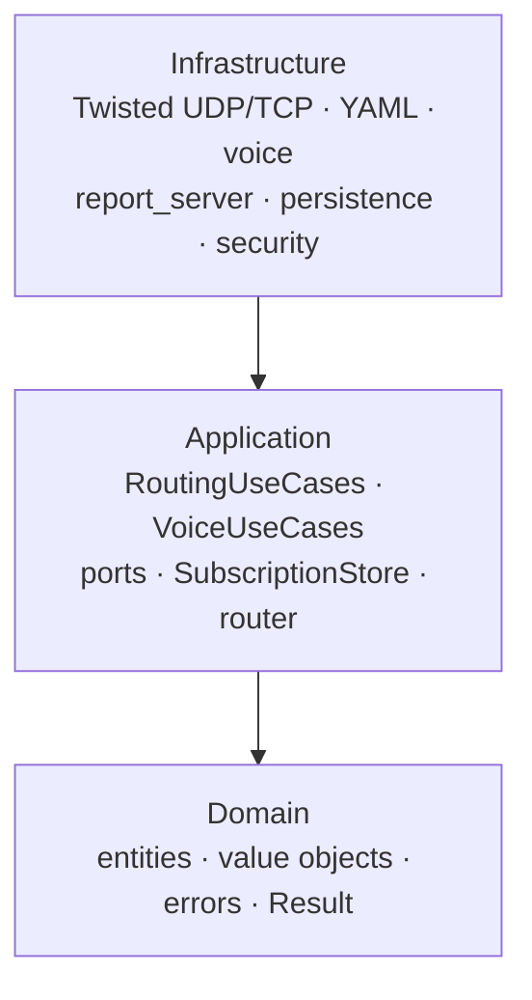

# Architecture (clean layering)

## Layers

1. **Domain** (`src/adn_server/domain/`) — entities, value objects, errors, `Result`. No I/O, no Twisted.
2. **Application** (`src/adn_server/application/`) — use cases (`RoutingUseCases`, `VoiceUseCases`, …) and **ports** (interfaces).
3. **Infrastructure** (`src/adn_server/infrastructure/`) — YAML config, Twisted UDP/TCP, voice, persistence, security adapters.

**Dependency rule:** infrastructure → application → domain (inward only).

## Entrypoint

`main.py` wires configuration, **LoopingCall** timers, factories for **HBPProtocol**, report client, and injects use cases.

## Runtime routing authority

Voice routing is driven by **`SubscriptionStore`** (domain subscriptions). `RoutingUseCases` orchestrates `dmrd_received` and delegates forward resolution to **`SubscriptionRouter`**.

Conceptual comparison with legacy **`BRIDGES`**: [BRIDGES vs Subscriptions](bridges-vs-subscriptions.md).

Performance changes in 2.x (indexes, reporting, integrated proxy): [Performance (2.x)](performance.md).

**Drop-in plugins** (voice/unit-data bus, `ServerPlugin` contract): [Plugins user guide](../user-guide/plugins.md). Reference skeleton: `plugins/example/` in the repository root.

- **`InMemoryAclRouter`** (`AclRouter` port) — ACL range checks only (`acl_check`).
- **`routing_table_for_report()`** — export shim for monitor/report (legacy BRIDGE_SND shape); not used for runtime forwards.

Wire opcodes and YAML keys may still say “bridge” for legacy monitor compatibility (`BRIDGE_SND`, `GEN_STAT_BRIDGES`).

## Where to read code

| Topic | Location |
|-------|----------|
| Voice routing, `dmrd_received`, OpenBridge forward | `application/routing_use_cases.py`, `application/routing/` |
| Subscription store, router, in-band rules | `application/subscription/` |
| HBP / OpenBridge UDP | `infrastructure/twisted_adapters/udp_hbp.py` |
| Report TCP | `infrastructure/twisted_adapters/report_server.py` (factory), routing events from use cases |
| Voice / TTS | `application/voice_use_cases.py`, `infrastructure/voice/` |
| Hotspot proxy (fan-in) | `infrastructure/proxy/` (`udp_fanin.py`, `runtime.py`), `application/proxy/` use cases |
| Self-service (MySQL) | `infrastructure/proxy/self_service_bridge.py`, `infrastructure/proxy/persistence/` |
| Dynamic TG persistence | `application/dynamic_tg_use_cases.py`, `infrastructure/persistence/dynamic_tg_repository.py`, `application/routing/dynamic_tg_restore.py` |

## Configuration as shared state

A **mutable `config` dict** is passed through adapters; runtime updates (options, `SUB_MAP`, OpenBridge `_bcsq`) remain visible globally for the lifetime of the process.
