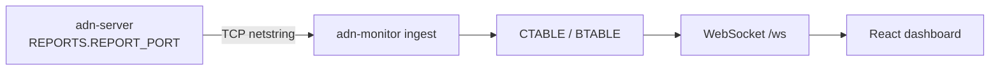

# Monitoring and reports

## TCP report channel

When **`REPORTS`** is enabled in the server config, the **ADN DMR Peer Server** listens on TCP and **report clients** (typically **adn-monitor**) connect and receive:

- **HELLO** (opcode **`0xFF`**) — JSON sent **first** on each new TCP connection by **ADN DMR Server** (`adn-server`): `server` name, package **`version`**, **`protocol`** number, and **`features`** (e.g. `INGRESS`, `END_TX_FORWARD`, `PUSH_ON_CONNECT`). Lets the monitor tag the session as **v2** before any pickled payloads.
- **Report v1 (1.0.x pair):** **CONFIG_SND** / **BRIDGE_SND** (pickle), **BRDG_EVENT** (CSV).
- **Report v2 (2.x pair):** **TOPOLOGY_SND** / **ROUTING_TABLE_SND** (JSON), **VOICE_EVENT_SND**, optional **DELTA_SND** — same triggers (connect, **`CONFIG_REQ`** / **`BRIDGE_REQ`**, reload, peer changes, **`REPORT_INTERVAL`**).

**Report v2:** typed JSON (`topology`, `routing_table`, `voice_event`, `delta`) replaces pickle/CSV on the **2.x** server+monitor pair. Schema: [Report protocol v2 (JSON)](../protocols/report-v2.md).

**Version pairing:** **server 1.0.x + monitor 1.0.x** = report v1 (frozen tags). **server 2.x** emits **report v2 only** — requires **monitor 2.x** on the same line. No `dual` wire; monitor 1.0.x will not decode this server.

### Legacy dashboards (report-proxy)

If you keep an **old dashboard** whose backend monitor speaks **report v1** only (pickle/CSV, no HELLO v2), it **cannot** connect to **adn-server 2.x** on `REPORTS.REPORT_PORT`. Use the optional **[ADN-report-proxy](https://github.com/ce5rpy/ADN-report-proxy)** to translate **v2 → v1**: the proxy connects to the server; the legacy monitor connects to the proxy. **adn-monitor 2.x** does **not** need this proxy — connect it directly to the server.

See [Report proxy (legacy dashboards)](report-proxy.md) for topology, `REPORT_CLIENTS`, ports, and start order.

Older stacks (**legacy** `adn-dmr-server`-style) may **omit** HELLO. **adn-monitor** waits up to **`ADN_CONNECTION.HELLO_TIMEOUT_MS`** (see [Monitor configuration](../../monitor/configuration.md#adn_connection)); if no HELLO arrives, it assumes **legacy** reporting.

The **monitor** decodes these messages, updates its **CTABLE** / **BTABLE**, and (when MySQL is configured) persists Last Heard / statistics.

**Full stack:** [ADN Monitor overview](../../monitor/index.md) (FastAPI monitor, WebSocket, self-service).



### Report channel log lines (`adn-monitor` logger)

Python uses the logger name **`adn-monitor`** (see **`LOGGER.LOG_FILE`** in `adn-monitor.yaml`). Typical **INFO** lines for the TCP report client:

| Log prefix / text | Meaning |
|-------------------|---------|
| `(REPORT) Connection to report server established` | TCP session up; HELLO wait timer starts (**`HELLO_TIMEOUT_MS`**). |
| `(REPORT) stringReceived: HELLO opcode=ff …` | Raw HELLO frame seen on the wire. |
| `(REPORT) HELLO received: mode=v2 server=… version=… features=…` | HELLO JSON parsed; session treated as **v2** (**ADN DMR Server**). |
| `(REPORT) No HELLO in …s; assuming legacy adn-dmr-server …` | No **`0xFF`** before timeout — monitor keeps **legacy** mode (pickled CONFIG/BRIDGE only). Expected if the peer is classic **`adn-dmr-server`**. If you **know** the server is **ADN DMR Server** but still see this, check **`ADN_IP`** / **`ADN_PORT`**, **`REPORTS.REPORT_CLIENTS`**, firewalls, or raise **`HELLO_TIMEOUT_MS`** slightly on very slow links. |
| `(REPORT) CONFIG applied: …` / `(REPORT) BRIDGES applied: …` | Pickled snapshots applied to CTABLE/BTABLE. |

At **WARNING**: invalid HELLO JSON (`(REPORT) HELLO payload not valid JSON`), or **`Invalid GLOBAL.TIMEZONE`** if **`GLOBAL.TIMEZONE`** in YAML is not a valid IANA name.

## OpenBridge monitor semantics

- **`GROUP VOICE,INGRESS,RX`** — first sight of a stream on an OpenBridge **leg** (debug; full visibility in logs).
- **`GROUP VOICE,START,RX`** — **canonical** start after **loop control** (feeds dashboard chips / CTABLE).
- **`GROUP VOICE,END,…`** — call end; RX/TX variants depending on direction.

The dashboard shows **operational** state from **START** (canonical); the **Monitor** log shows **INGRESS** plus **START** for troubleshooting mesh duplicates.

### Dynamic UA chips (hotspot OPTIONS)

The monitor tracks **user-activated** TGs per hotspot for dashboard indigo chips:

| Peer OPTIONS | Monitor source |
|--------------|----------------|
| **SINGLE=1** | **`UA_SESSIONS`** in **CONFIG_SND** / `dashboard_state` (server source of truth). |
| **SINGLE=0** | Voice events (`BRDG_EVENT` / `voice_event`) — multiple dynamics per slot until cleared. |

**TG 4000** clears UA state via **`GROUP VOICE,INGRESS,RX`** with destination **4000** (server sends this because the voice path returns early and never emits a normal **START**). The monitor must **not** register **4000** as a dynamic TG.

**Version pairing:** **adn-server 2.0.0-rc.3** + **adn-monitor 2.0.0-rc.4** for dynamic TG persistence and TG 4000 monitor sync.

## Log file rotation (logrotate)

After **logrotate** renames or moves a log file (common pattern: **`create`** so the old path is rotated away and a **new empty file** appears at the configured path), the process may still hold an open file descriptor on the **previous inode**. Logs then appear “missing” from the current path until the process **reopens** its file handlers.

**Recommended:** use **`create`** (not **`copytruncate`** when the service supports signaling): **`copytruncate`** can race with concurrent writes and drop lines; **`WatchedFileHandler`** avoids signals but adds overhead per log record.

These processes handle **`SIGUSR2`** by reopening **`logging.FileHandler`** streams only — **they do not reload YAML**, databases, or Twisted configuration.

| Process | Typical config keys |
|---------|---------------------|
| **`adn-server`** / **`adn-echo`** | **`LOGGER.LOG_FILE`** (integrated proxy logs appear in the same file) |
| **`adn-monitor`** | **`LOG.PATH`** + **`LOG.LOG_FILE`** in `adn-monitor.yaml` |

Example **`/etc/logrotate.d/adn`** fragment (adjust paths and service names):

```text
/var/log/adn-server/adn-server.log {
    weekly
    rotate 12
    compress
    delaycompress
    missingok
    notifempty
    create 0640 adn adn
    postrotate
        /bin/kill -USR2 "$(systemctl show adn-server.service -p MainPID --value)" 2>/dev/null || true
    endscript
}
```

Repeat **`postrotate`** with **`kill -USR2`** for **`adn-echo`** and **`adn-monitor`** units if those logs are rotated on the same host. Use the correct **PID** (systemd **`MainPID`**, a pidfile, or **`kill`** targeting the process you manage).

## What reaches a hotspot (`tools/hotspot_probe.py`)

When users report cut or choppy calls, `tools/hotspot_probe.py` shows what the server actually delivers to one hotspot. It logs in to a MASTER like a hotspot, subscribes to talkgroups through OPTIONS and never transmits. For every group voice stream it writes one CSV row: start and end (UTC), slot, TG, source, stream ID, frames received, the longest silence between two frames (`max_gap_s`), and whether it ended with a terminator (`terminated`).

```bash
ADN_PROBE_PASSWORD='...' python3 tools/hotspot_probe.py --callsign CALL 127.0.0.1 62031 213003599 \
    "TS1=214;TS2=3340,9140;" probe.csv
python3 tools/hotspot_probe.py --summary probe.csv
```

Use a hotspot ID of your own (your DMR ID + two digits), the password it logs in with and your callsign. Only the standard library is needed, so it runs on the server host or anywhere that can reach the MASTER.

Look up the same stream ID in the server log:

- `*CALL END*` of an OpenBridge call shows `Loss` (packets missing by sequence) and `Max gap` (the longest silence as the call came in).
- If the probe's `max_gap_s` matches the server's `Max gap`, the silence was already there when the call came in over the mesh. If only the probe shows it, or `terminated` is 0 while the server logged the call to its end, it appeared on the way from this server to the hotspot.
- A hotspot listening to several TGs on one slot hears one stream at a time, so a stream that started while another one was playing reaches it late. That is not loss.

## Requirements

- Network reachability from the **monitor host** to the server’s **`REPORTS.REPORT_PORT`** (and the server’s **`REPORT_CLIENTS`** allow list must include the monitor if used).
- **adn-monitor** `ADN_CONNECTION.ADN_IP` / **`ADN_PORT`** must match the server — see [Monitor configuration](../../monitor/configuration.md#adn_connection).

## Self-service and hotspots

Operators editing **device options** from the dashboard use the **self-service** flow (MySQL **`Clients`**, **RPTO** toward the conference MASTER). In current **ADN DMR Peer Server** deployments this runs **inside `adn-server.py`**: configure **`SELF_SERVICE`** and **`PROXY`** in **`adn-server.yaml`** (see [Hotspot proxy](hotspot-proxy.md)). Dashboard semantics: [Self-service](../../monitor/self-service.md).

Hotspot proxy logs are part of **`adn-server`** when **`PROXY`** is enabled — see [Hotspot proxy (integrated)](hotspot-proxy.md).
