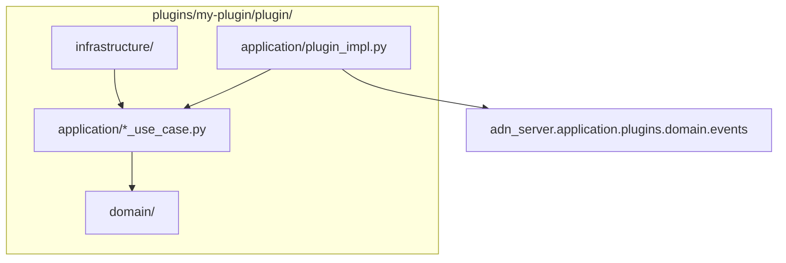

# Plugins

Drop-in **plugins** extend the peer server without modifying core code. The framework lives in `src/adn_server/application/plugins/`; each plugin is a directory under `plugins/<name>/` loaded at runtime.

The repository ships one reference skeleton: `plugins/example/` (disabled by default).

---

## Directory layout

```
plugins/<plugin-name>/
  config.yaml              # enabled: true|false (+ options)
  plugin/
    __init__.py            # must export create_plugin()
    domain/                # pure logic, no I/O
    application/           # use cases, ServerPlugin adapter
    infrastructure/        # files, HTTP, thread pools
  tests/
```

Enable a plugin in its `config.yaml` and reload the server:

```bash
systemctl reload adn-server    # SIGHUP — rescans plugins/
```

---

## Server configuration (`PLUGINS`)

Optional block in **`adn-server.yaml`** (not in `adn-server.example.yaml`):

```yaml
PLUGINS:
  directory: plugins          # default: <project_root>/plugins
  master_kill: false          # true → unload all plugins
  overrides:
    my-plugin:
      some_key: value         # merged into plugin config at load/reload
```

| Key | Role |
|-----|------|
| `directory` | Absolute path or relative to project root |
| `master_kill` | Emergency disable — no plugins loaded |
| `overrides` | Per-plugin config patches without editing `plugins/<name>/config.yaml` |

On **SIGHUP**, `PluginManager.rescan()` loads new plugins, unloads removed ones, and calls `on_reload()` when `config.yaml` changed.

### `config.yaml` reserved keys

The loader strips these before passing config to `on_load` / `on_reload`:

| Key | Role |
|-----|------|
| `enabled` | Must be `true` to load the plugin |
| `depends_on` | List of plugin names — topological load order |
| `hot_reload_seconds` | Reserved for future use |

---

## `ServerPlugin` contract

Defined in `src/adn_server/application/plugins/domain/protocol.py`:

| Method | Thread | Role |
|--------|--------|------|
| `name: str` | — | Plugin identifier (directory name) |
| `on_load(bus, config, server_ctx)` | reactor | Read config; subscribe to bus if needed |
| `on_event(event)` | **reactor** | Handle bus events — **O(1), no blocking I/O** |
| `on_reload(config)` | reactor | Optional hot-reload after `config.yaml` change |
| `on_shutdown()` | reactor | Flush buffers; stop background workers |

Factory entry point:

```python
# plugins/<name>/plugin/__init__.py
def create_plugin() -> ServerPlugin:
    return MyPlugin()
```

---

## `ServerContext`

Passed to `on_load` as `server_ctx` (`application/plugins/application/context.py`):

| Field | Use |
|-------|-----|
| `config` | Full server config dict |
| `project_root` | Server install path |
| `defer_to_thread(fn, *args)` | Run blocking I/O off the reactor |
| `call_from_reactor(fn, *args)` | Schedule callback on reactor thread |
| `call_later(delay_s, fn, *args)` | Reactor timer |

**Pattern:** do only dispatch in `on_event`; call `defer_to_thread` for file writes, HTTP, heavy CPU.

---

## Event bus

`PluginBus` (`application/plugins/application/bus.py`) delivers events to every loaded plugin's `on_event`.

- Events are emitted **after voice/data has been forwarded** (`emit_deferred` — next reactor tick).
- Uncaught exceptions increment a per-plugin trip counter; after repeated failures the plugin is **disabled** and `on_shutdown()` is called (circuit breaker).
- `bus.subscribe(handler)` is available for internal handlers; plugins normally implement `on_event` only.

---

## Event types

Pure domain dataclasses in `application/plugins/domain/events.py`. Import in your plugin:

```python
from adn_server.application.plugins.domain.events import (
    VoiceCallStart,
    VoiceCallFrame,
    VoiceCallEnd,
    UnitDataStart,
    UnitDataFrame,
    UnitDataEnd,
)
```

| Event | When |
|-------|------|
| `VoiceCallStart` | Group or private voice call begins |
| `VoiceCallFrame` | One AMBE frame (`dmrpkt`, `frame_type`, `dtype_vseq`) |
| `VoiceCallEnd` | Call ends (`duration_s`, `frame_count`) |
| `UnitDataStart` | Unit-data session begins |
| `UnitDataFrame` | One data frame (`raw_data`, `data_label`, `seq`, `bits`, …) |
| `UnitDataEnd` | Unit-data session ends (`duration_s`, `packet_count`) |

Each event carries a **`CallLegContext`** (`event.context`) with metadata:

| Field | Meaning |
|-------|---------|
| `call_family` | `"GROUP"` or `"PRIVATE"` |
| `direction` | `"RX"` or `"TX"` |
| `origin_system` | Logical system name (bridge leg) |
| `system_mode` | `MASTER`, `PEER`, or `OPENBRIDGE` |
| `peer_id`, `src_id`, `dst_id`, `slot`, `stream_id` | DMR identifiers |
| `server_id` | Reporting server id |
| `is_synthetic`, `is_proxy_ingress` | Synthetic / proxy flags |
| `pkt_time` | Unix timestamp |
| `forwarded_systems` | Tuple of systems this leg was forwarded to |
| `obp_*`, `ber`, `rssi` | OpenBridge / RF metadata when present |
| `extra` | Additional dict (e.g. talker alias on end) |

Use `event.context.to_metadata_dict()` for JSON-serializable output.

Events originate from `VoicePluginBridge` and `DataPluginBridge`, hooked into routing after forward resolution.

---

## Clean architecture in plugins

Use the same inward dependency rule as the core server ([Architecture](../development/architecture.md)):



| Layer | Responsibility |
|-------|----------------|
| `plugin/__init__.py` | Factory only — `create_plugin()` |
| `application/plugin_impl.py` | `ServerPlugin` adapter: `isinstance` checks, delegate to use cases |
| `application/` | Orchestration (use cases, session state) |
| `domain/` | Pure types and rules — no Twisted, no files, no sockets |
| `infrastructure/` | Writers, HTTP clients, pools — uses `defer_to_thread` |

---

## Reference example

Study `plugins/example/` in the repository root:

- `enabled: false` in committed `config.yaml` (no secrets).
- `DEBUG` log on every event.
- Writes one JSON file per session under `example-events/` on `VoiceCallEnd` / `UnitDataEnd`.
- Tests in `plugins/example/tests/`.

To try it: set `enabled: true`, reload, make a call, inspect `example-events/<stream_id>.json`.

---

## Tests

Plugin tests live next to the plugin, not in `adn-server/tests/`:

```bash
cd plugins/example
python3 -m pytest tests/ -q
```

Framework tests (`test_plugin_bus.py`, `test_voice_bridge.py`, …) remain in the core test suite.

---

## Best practices

1. **Never block the reactor** in `on_event` — delegate I/O and CPU-heavy work.
2. **Version `config.example.yaml`** alongside your plugin; keep `config.yaml` local and gitignored when it holds tokens.
3. **Catch errors** in background workers; uncaught exceptions in `on_event` trip the circuit breaker.
4. **Use `depends_on`** when one plugin must load after another.
5. Copy the **`example`** skeleton when starting a new plugin — rename the directory and implement your use case.
