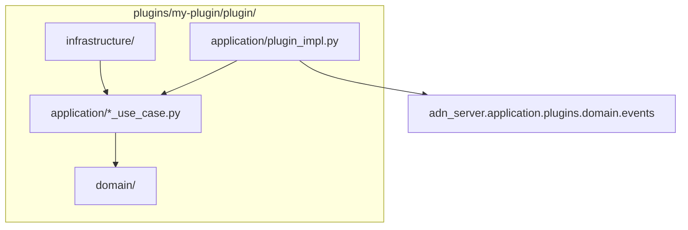

# Plugins

Drop-in **plugins** extend the peer server without modifying core code. The framework lives in `src/adn_server/application/plugins/`; each plugin is a directory under `plugins/<name>/` loaded at runtime.

The repository ships one reference skeleton: `plugins/example/` (disabled by default).

---

## Directory layout

```
plugins/<plugin-name>/
  config.yaml              # enabled: true|false (+ options)
  plugin/
    __init__.py            # must export create_plugin()
    domain/                # pure logic, no I/O
    application/           # use cases, ServerPlugin adapter
    infrastructure/        # files, HTTP, thread pools
  tests/
```

Enable a plugin in its `config.yaml` and reload the server:

```bash
systemctl reload adn-server    # SIGHUP — rescans plugins/
```

---

## Server configuration (`PLUGINS`)

Optional block in **`adn-server.yaml`** (not in `adn-server.example.yaml`):

```yaml
PLUGINS:
  directory: plugins          # default: <project_root>/plugins
  master_kill: false          # true → unload all plugins
  overrides:
    my-plugin:
      some_key: value         # merged into plugin config at load/reload
```

| Key | Role |
|-----|------|
| `directory` | Absolute path or relative to project root |
| `master_kill` | Emergency disable — no plugins loaded |
| `overrides` | Per-plugin config patches without editing `plugins/<name>/config.yaml` |
| `send` | Per-plugin permission to send unit data and group voice — see [Sending](#sending-unit-data-and-group-voice-opt-in) |

On **SIGHUP**, the `PLUGINS` block is re-read from `adn-server.yaml` (removing it counts as removing everything in it) and `PluginManager.rescan()` loads new plugins, unloads removed ones, and calls `on_reload()` when `config.yaml` changed.

### `config.yaml` reserved keys

The loader strips these before passing config to `on_load` / `on_reload`:

| Key | Role |
|-----|------|
| `enabled` | Must be `true` to load the plugin |
| `depends_on` | List of plugin names — topological load order |
| `hot_reload_seconds` | Reserved for future use |

---

## `ServerPlugin` contract

Defined in `src/adn_server/application/plugins/domain/protocol.py`:

| Method | Thread | Role |
|--------|--------|------|
| `name: str` | — | Plugin identifier (directory name) |
| `events` *(optional)* | — | Event classes the plugin handles, e.g. `(VoiceCallFrame, VoiceCallEnd)`. The server then skips building the others — see [Declaring the events you need](#declaring-the-events-you-need). Without it, every event is delivered |
| `on_load(bus, config, server_ctx)` | reactor | Read config; subscribe to bus if needed |
| `on_event(event)` | **reactor** | Handle bus events — **O(1), no blocking I/O** |
| `on_reload(config)` | reactor | Optional hot-reload after `config.yaml` change |
| `on_shutdown()` | reactor | Flush buffers; stop background workers |

Factory entry point:

```python
# plugins/<name>/plugin/__init__.py
def create_plugin() -> ServerPlugin:
    return MyPlugin()
```

---

## `ServerContext`

Passed to `on_load` as `server_ctx` (`application/plugins/application/context.py`):

| Field | Use |
|-------|-----|
| `config` | Full server config dict |
| `project_root` | Server install path |
| `defer_to_thread(fn, *args)` | Run blocking I/O off the reactor |
| `call_from_reactor(fn, *args)` | Schedule callback on reactor thread |
| `call_later(delay_s, fn, *args)` | Reactor timer |
| `send_dmrd(pkt) -> bool` | Send one DMRD frame — **only** for a plugin granted it in `PLUGINS.send`, otherwise `None` ([Sending](#sending-unit-data-and-group-voice-opt-in)) |

**Pattern:** do only dispatch in `on_event`; call `defer_to_thread` for file writes, HTTP, heavy CPU.

---

## Sending unit data and group voice (opt-in)

A plugin can send **unit data** (data header, rate 1/2 and 3/4 blocks, CSBK: ARS, LRRP, SMS…) and **group voice** on granted talkgroups (voice beacons, announcements) with `server_ctx.send_dmrd(pkt)`, one complete HBP `DMRD` frame per call. Enabling a plugin never lets it transmit: the sysop grants it per plugin in `adn-server.yaml`:

```yaml
PLUGINS:
  send:
    d-aprs:
      allowed_src_ids: [900999]   # rf_src the plugin may send as; required
      max_frames_per_s: 40        # per-plugin token bucket (default 40)
    beacon:
      allowed_src_ids: [2130035]
      group_voice_tgs: [213]      # group voice only on these TGs; none: unit data only
```

- `send_dmrd` is `None` unless the plugin has an entry with at least one source ID.
- The allowlist and the rate limit guard against a **buggy** plugin (sending as a radio, flooding the mesh). They are no sandbox: a plugin runs in-process with the live config and could rewrite its own entry, so only install plugins you trust.
- Each frame is checked against the **current** config: removing the entry (SIGHUP) or `master_kill` stops sending at once. Granting it to a plugin already loaded needs that plugin reloaded.
- Rejected frames (not unit data, source not allowed, over the rate) return `False` and are logged and counted; the first frame of each stream is logged at INFO.
- Called on the reactor thread (`on_event`, `call_later`), the frame is routed at once and the result is whether the server **accepted** it; a plugin sending voice must stop when it gets `False`. From another thread the frame is queued to the reactor and `True` only means the guards passed.

How the server treats them:

| | |
|---|---|
| Ingress | The same MASTER as scheduled announcements, with the SERVER_ID as peer |
| Delivery | Unit data path only: `SUB_MAP` / hotspot peer ID, to the exact hotspot of the destination — also on the ingress MASTER itself |
| `SUB_MAP` | Never learns the plugin's source ID (so replies to it are not spread over the MASTER's hotspots) |
| OpenBridge / `DATA-GATEWAY` | No fan-out: plugin frames stay on this server |
| Events | Reach plugins with `is_synthetic=True`, so a plugin can ignore its own frames |

Group voice is routed **like a scheduled announcement** (synthetic PTT on the same MASTER): through the TG's bridges, OpenBridge legs included, and to the hotspots of that MASTER. While a plugin stream plays it holds that MASTER slot, so routed calls find it busy; a radio or another stream on the slot makes the next frame fail. The terminator frees the slot. Private voice can't be sent.

Pacing (about 60 ms per burst) is the plugin's job, e.g. with `call_later`.

---

## Event bus

`PluginBus` (`application/plugins/application/bus.py`) delivers events to every loaded plugin's `on_event`.

- Events are emitted **after voice/data has been forwarded** (`emit_deferred` — next reactor tick).
- Uncaught exceptions increment a per-plugin trip counter; after repeated failures the plugin is **disabled** and `on_shutdown()` is called (circuit breaker).
- `bus.subscribe(handler)` is available for internal handlers; plugins normally implement `on_event` only.
- Deferred events are batched: all those of one reactor tick are delivered by a single `call_later`.

### Declaring the events you need

Building an event costs the server work on every frame (a voice call is ~17 frames per second, per stream), whether or not a plugin looks at it. A plugin that lists the events it handles lets the server skip the rest:

```python
from adn_server.application.plugins.domain.events import UnitDataFrame

class DAprsPlugin:
    name = "d-aprs"
    events = (UnitDataFrame,)   # no voice events are built for this plugin
```

Measured on a Raspberry Pi 5, group voice routed to 6 OpenBridges and a MASTER (48 µs per frame with no plugin):

| Plugins loaded | Cost per voice frame |
|---|---|
| One that declares only unit data events | +1.4 µs |
| One that declares voice events, or declares nothing | +11 µs |

`events` is read when the plugin is registered (after `on_load`). Internal handlers added with `bus.subscribe` receive every event.

---

## Event types

Pure domain dataclasses in `application/plugins/domain/events.py`. Import in your plugin:

```python
from adn_server.application.plugins.domain.events import (
    VoiceCallStart,
    VoiceCallFrame,
    VoiceCallEnd,
    UnitDataStart,
    UnitDataFrame,
    UnitDataEnd,
)
```

| Event | When |
|-------|------|
| `VoiceCallStart` | Group or private voice call begins |
| `VoiceCallFrame` | One AMBE frame (`dmrpkt`, `frame_type`, `dtype_vseq`) |
| `VoiceCallEnd` | Call ends (`duration_s`, `frame_count`) |
| `UnitDataStart` | Unit-data session begins |
| `UnitDataFrame` | One data frame (`raw_data`, `data_label`, `seq`, `bits`, …) |
| `UnitDataEnd` | Unit-data session ends (`duration_s`, `packet_count`) |

Each event carries a **`CallLegContext`** (`event.context`) with metadata:

| Field | Meaning |
|-------|---------|
| `call_family` | `"GROUP"` or `"PRIVATE"` |
| `direction` | `"RX"` or `"TX"` |
| `origin_system` | Logical system name (bridge leg) |
| `system_mode` | `MASTER`, `PEER`, or `OPENBRIDGE` |
| `peer_id`, `src_id`, `dst_id`, `slot`, `stream_id` | DMR identifiers |
| `server_id` | Reporting server id |
| `is_synthetic`, `is_proxy_ingress` | Synthetic / proxy flags |
| `pkt_time` | Unix timestamp |
| `forwarded_systems` | Tuple of systems this leg was forwarded to |
| `obp_*`, `ber`, `rssi` | OpenBridge / RF metadata when present |
| `extra` | Additional dict (e.g. talker alias on end) |

Use `event.context.to_metadata_dict()` for JSON-serializable output.

Events originate from `VoicePluginBridge` and `DataPluginBridge`, hooked into routing after forward resolution.

---

## Clean architecture in plugins

Use the same inward dependency rule as the core server ([Architecture](../development/architecture.md)):



| Layer | Responsibility |
|-------|----------------|
| `plugin/__init__.py` | Factory only — `create_plugin()` |
| `application/plugin_impl.py` | `ServerPlugin` adapter: `isinstance` checks, delegate to use cases |
| `application/` | Orchestration (use cases, session state) |
| `domain/` | Pure types and rules — no Twisted, no files, no sockets |
| `infrastructure/` | Writers, HTTP clients, pools — uses `defer_to_thread` |

---

## Using the example plugin

`plugins/example/` is a working, disabled-by-default plugin — enable it to see the framework in action, or copy its tree as a starting point for your own ([Clean architecture in plugins](#clean-architecture-in-plugins) above).

### What it does

- Logs a `DEBUG` line `(EXAMPLE) …` for every bus event (`VoiceCallStart`/`Frame`/`End`, `UnitDataStart`/`Frame`/`End`).
- Tracks each session, keyed by `(origin_system, stream_id)`, and on `VoiceCallEnd` / `UnitDataEnd` writes one JSON file with call metadata, duration, and frame/packet count.
- No HTTP calls, no filters, no secrets — safe to enable as-is (`plugins/example/plugin/application/plugin_impl.py`).

### Enable it

```yaml
# plugins/example/config.yaml
enabled: true
output_dir: example-events   # relative to the project root; created on first write
```

```bash
systemctl reload adn-server    # SIGHUP — PluginManager rescans plugins/
```

### Config options

| Key | Default | Role |
|-----|---------|------|
| `enabled` | `false` | Must be `true` to load the plugin |
| `output_dir` | `example-events` | Where session JSON files are written, relative to the server's project root |

### Output

One file per session: `<output_dir>/<stream_id>.json` (`stream_id` as a plain integer, not hex), pretty-printed with sorted keys. The write runs off the reactor thread via `defer_to_thread`, so it never blocks call handling.

Example — a group voice call on `SYSTEM` that ended after 2.16s, relayed onward to `OBP-USA`:

```json
{
  "call_family": "GROUP",
  "direction": "RX",
  "dst_id": 91,
  "duration_s": 2.16,
  "ended_at": "2026-09-18T21:05:11.532000Z",
  "event_kind": "voice",
  "forwarded_systems": ["OBP-USA"],
  "frame_count": 36,
  "is_proxy_ingress": false,
  "is_synthetic": false,
  "origin_system": "SYSTEM",
  "peer_id": 312000,
  "pkt_time": 1758229511.532,
  "server_id": 73010,
  "slot": 1,
  "src_id": 7300391,
  "started_at": "2026-09-18T21:05:09.372000Z",
  "stream_id": 1234567890,
  "system_mode": "MASTER"
}
```

For unit-data sessions `event_kind` is `"unit_data"` and the count field is `packet_count` instead of `frame_count`. Legs that crossed an OpenBridge also carry `obp_source_server_id`, `obp_hops`, `obp_source_rptr_id`, `ber`, `rssi` when present (see [Event types](#event-types) above).

To try it end to end: set `enabled: true`, reload, make a call or send unit data through the server, then check `example-events/<stream_id>.json` under the project root. Its own tests (`plugins/example/tests/`) cover session tracking and the JSON record shape — see [Tests](#tests) below to run them.

---

## Tests

Plugin tests live next to the plugin, not in `adn-server/tests/`:

```bash
cd plugins/example
python3 -m pytest tests/ -q
```

Framework tests (`test_plugin_bus.py`, `test_voice_bridge.py`, …) remain in the core test suite.

---

## Best practices

1. **Never block the reactor** in `on_event` — delegate I/O and CPU-heavy work.
2. **Version `config.example.yaml`** alongside your plugin; keep `config.yaml` local and gitignored when it holds tokens.
3. **Catch errors** in background workers; uncaught exceptions in `on_event` trip the circuit breaker.
4. **Use `depends_on`** when one plugin must load after another.
5. Copy the **`example`** skeleton when starting a new plugin — rename the directory and implement your use case.
