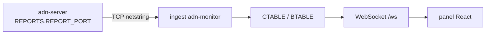

# Monitor e informes

## Canal TCP de informes

Cuando **`REPORTS`** está habilitado en la config del servidor, el **ADN DMR Peer Server** escucha en TCP y los **clientes de informes** (típicamente **adn-monitor**) se conectan y reciben:

- **HELLO** (opcode **`0xFF`**) — JSON enviado **el primero** en cada conexión TCP por **ADN DMR Server** (`adn-server`): nombre **`server`**, **`version`** del paquete, número de **`protocol`** y lista **`features`** (p. ej. `INGRESS`, `END_TX_FORWARD`, `PUSH_ON_CONNECT`). Permite al monitor marcar la sesión como **v2** antes de las cargas pickle.
- **Report v1 (par 1.0.x):** **CONFIG_SND** / **BRIDGE_SND** (pickle), **BRDG_EVENT** (CSV).
- **Report v2 (par 2.x):** **TOPOLOGY_SND** / **ROUTING_TABLE_SND** (JSON), **VOICE_EVENT_SND**, **DELTA_SND** opcional — mismos disparadores (conexión, **`CONFIG_REQ`** / **`BRIDGE_REQ`**, reload, peers, **`REPORT_INTERVAL`**).

**Informes v2:** JSON tipado (`topology`, `routing_table`, `voice_event`, `delta`) sustituye pickle/CSV en el par **servidor 2.x + monitor 2.x**. Esquema: [Protocolo de informes v2 (JSON)](../protocols/report-v2.md).

**Acoplamiento de versiones:** **servidor 1.0.x + monitor 1.0.x** = report v1 (tags). **servidor 2.x** emite **solo report v2** — requiere **monitor 2.x**. Sin wire `dual`; monitor 1.0.x no decodifica este servidor.

### Paneles legacy (report-proxy)

Si mantienes un **panel antiguo** cuyo backend monitor solo habla **informe v1** (pickle/CSV, sin HELLO v2), **no puede** conectarse a **adn-server 2.x** en `REPORTS.REPORT_PORT`. Usa el opcional **[ADN-report-proxy](https://github.com/ce5rpy/ADN-report-proxy)** para traducir **v2 → v1**: el proxy se conecta al servidor; el monitor legacy se conecta al proxy. **adn-monitor 2.x** **no** necesita este proxy — conéctalo directamente al servidor.

Ver [Proxy de informes (paneles legacy)](report-proxy.md) para topología, `REPORT_CLIENTS`, puertos y orden de arranque.

Las pilas antiguas (**legado** estilo `adn-dmr-server`) pueden **omitir** HELLO. **adn-monitor** espera hasta **`ADN_CONNECTION.HELLO_TIMEOUT_MS`** (ver [Configuración del monitor](../../monitor/configuration.md#adn_connection)); si no llega HELLO, asume informes **legacy**.

El **monitor** decodifica estos mensajes, actualiza **CTABLE** / **BTABLE** y (con MySQL configurado) persiste Last Heard / estadísticas.

**Pila completa:** [Descripción general del ADN Monitor](../../monitor/index.md) (monitor FastAPI, WebSocket, self-service).



### Líneas de log del canal de informes (logger `adn-monitor`)

Python usa el nombre de logger **`adn-monitor`** (ver **`LOGGER.LOG_FILE`** en `adn-monitor.yaml`). **INFO** típicos del cliente TCP de informes:

| Prefijo / texto del log | Significado |
|-------------------------|-------------|
| `(REPORT) Connection to report server established` | Sesión TCP activa; arranca la espera de HELLO (**`HELLO_TIMEOUT_MS`**). |
| `(REPORT) stringReceived: HELLO opcode=ff …` | Trama HELLO cruda en el cable. |
| `(REPORT) HELLO received: mode=v2 server=… version=… features=…` | JSON HELLO parseado; sesión **v2** (**ADN DMR Server**). |
| `(REPORT) No HELLO in …s; assuming legacy adn-dmr-server …` | No hay **`0xFF`** antes del timeout — modo **legacy** (solo CONFIG/BRIDGE pickle). Normal si el peer es **`adn-dmr-server`** clásico. Si **sabes** que el servidor es **ADN DMR Server** y aún ves esto, revisa **`ADN_IP`** / **`ADN_PORT`**, **`REPORTS.REPORT_CLIENTS`**, cortafuegos, o sube un poco **`HELLO_TIMEOUT_MS`** en enlaces muy lentos. |
| `(REPORT) CONFIG applied: …` / `(REPORT) BRIDGES applied: …` | Instantáneas pickle aplicadas a CTABLE/BTABLE. |

En **WARNING**: JSON HELLO inválido (`(REPORT) HELLO payload not valid JSON`), o **`Invalid GLOBAL.TIMEZONE`** si **`GLOBAL.TIMEZONE`** no es un nombre IANA válido.

## Semántica del monitor en OpenBridge

- **`GROUP VOICE,INGRESS,RX`** — primera aparición de un flujo en una pata OpenBridge (depuración; visibilidad completa en logs).
- **`GROUP VOICE,START,RX`** — inicio **canónico** tras **control de bucle** (alimenta chips del panel / CTABLE).
- **`GROUP VOICE,END,…`** — fin de llamada; variantes RX/TX según dirección.

El panel muestra el estado **operativo** desde **START** (canónico); el **log del Monitor** muestra **INGRESS** más **START** para depurar duplicados en malla.

### Chips UA dinámicos (OPTIONS del hotspot)

El monitor rastrea TG **activados por usuario** por hotspot para los chips índigo del panel:

| OPTIONS del peer | Fuente en el monitor |
|----------------|----------------------|
| **SINGLE=1** | **`UA_SESSIONS`** en **CONFIG_SND** / `dashboard_state` (el servidor es fuente de verdad). |
| **SINGLE=0** | Eventos de voz (`BRDG_EVENT` / `voice_event`) — varios dinámicos por slot hasta limpiar. |

**TG 4000** limpia el estado UA con **`GROUP VOICE,INGRESS,RX`** y destino **4000** (el servidor lo envía porque la ruta de voz corta antes y no emite un **START** normal). El monitor **no** debe registrar **4000** como TG dinámico.

**Emparejamiento de versiones:** **adn-server 2.0.0-rc.3** + **adn-monitor 2.0.0-rc.4** para persistencia de TG dinámicos y sincronización TG 4000 en el monitor.

## Rotación de logs (logrotate)

Tras que **logrotate** renombre o mueva el fichero de log (patrón habitual: **`create`** — el fichero antiguo rota y aparece uno **nuevo vacío** en la ruta configurada), el proceso puede seguir con el descriptor abierto sobre el **inodo anterior**. Los logs parecen “no escribirse” en la ruta actual hasta que el proceso **reabra** los `FileHandler`.

**Recomendado:** usar **`create`** (evitar **`copytruncate`** si el servicio admite señal): **`copytruncate`** puede competir con escrituras concurrentes y **perder líneas**; **`WatchedFileHandler`** evita la señal pero tiene coste **por cada línea** de log.

Estos procesos tratan **`SIGUSR2`** solo para **reabrir** los ficheros de log (`logging.FileHandler`). **No recargan YAML**, bases de datos ni la configuración de Twisted.

| Proceso | Claves típicas de configuración |
|---------|-----------------------------------|
| **`adn-server`** / **`adn-echo`** | **`LOGGER.LOG_FILE`** (los logs del proxy integrado van al mismo fichero) |
| **`adn-monitor`** | **`LOG.PATH`** + **`LOG.LOG_FILE`** en `adn-monitor.yaml` |

Ejemplo de fragmento en **`/etc/logrotate.d/adn`** (adaptar rutas y nombres de unidad):

```text
/var/log/adn-server/adn-server.log {
    weekly
    rotate 12
    compress
    delaycompress
    missingok
    notifempty
    create 0640 adn adn
    postrotate
        /bin/kill -USR2 "$(systemctl show adn-server.service -p MainPID --value)" 2>/dev/null || true
    endscript
}
```

Repite **`postrotate`** con **`kill -USR2`** para **`adn-echo`** y **`adn-monitor`** si rotas sus logs en el mismo host. Usa el **PID** correcto (**`MainPID`** de systemd, pidfile, o el proceso que gestiones).

## Qué le llega a un hotspot (`tools/hotspot_probe.py`)

Cuando llegan quejas de llamadas cortadas o entrecortadas, `tools/hotspot_probe.py` muestra lo que el servidor entrega de verdad a un hotspot. Se conecta a un MASTER como un hotspot, se suscribe a TGs mediante OPTIONS y nunca transmite. Por cada stream de voz de grupo escribe una fila CSV: inicio y fin (UTC), slot, TG, origen, stream ID, tramas recibidas, el silencio más largo entre dos tramas (`max_gap_s`) y si terminó con terminador (`terminated`).

```bash
ADN_PROBE_PASSWORD='...' python3 tools/hotspot_probe.py --callsign INDICATIVO 127.0.0.1 62031 213003599 \
    "TS1=214;TS2=3340,9140;" probe.csv
python3 tools/hotspot_probe.py --summary probe.csv
```

Usa un ID de hotspot propio (tu DMR ID + dos cifras), la contraseña con la que entra y tu indicativo. Solo necesita la biblioteca estándar, así que funciona en el propio servidor o en cualquier máquina que llegue al MASTER.

Busca el mismo stream ID en el log del servidor:

- El `*CALL END*` de una llamada OpenBridge muestra `Loss` (paquetes que faltan por número de secuencia) y `Max gap` (el silencio más largo tal como entró la llamada).
- Si el `max_gap_s` de la sonda coincide con el `Max gap` del servidor, el silencio ya venía en la llamada al entrar por la malla. Si solo lo ve la sonda, o `terminated` es 0 mientras el servidor registró la llamada hasta el final, apareció entre este servidor y el hotspot.
- Un hotspot que escucha varios TG por un mismo slot oye un stream cada vez: uno que empezó mientras sonaba otro le llega tarde. Eso no es pérdida.

## Requisitos

- Conectividad de red desde el **host del monitor** al **`REPORTS.REPORT_PORT`** del servidor (y la lista **`REPORT_CLIENTS`** del servidor debe incluir al monitor si se usa).
- **adn-monitor** `ADN_CONNECTION.ADN_IP` / **`ADN_PORT`** debe coincidir con el servidor — ver [Configuración del monitor](../../monitor/configuration.md#adn_connection).

## Self-service y hotspots

Los operadores que editan **opciones de dispositivo** desde el panel usan el flujo **self-service** (MySQL **`Clients`**, **RPTO** hacia el MASTER de conferencia). En despliegues actuales de **ADN DMR Peer Server** esto corre **dentro de `adn-server.py`**: configura **`SELF_SERVICE`** y **`PROXY`** en **`adn-server.yaml`** (ver [Proxy hotspot](hotspot-proxy.md)). Semántica del panel: [Self-service](../../monitor/self-service.md).

Los logs del proxy hotspot forman parte de **`adn-server`** cuando **`PROXY`** está activo — ver [Proxy hotspot integrado](hotspot-proxy.md).
