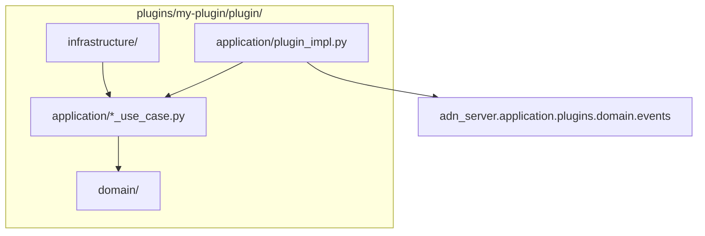

# Plugins

Los **plugins** drop-in amplían el peer server sin modificar el código del núcleo. El framework está en `src/adn_server/application/plugins/`; cada plugin es un directorio bajo `plugins/<name>/` cargado en tiempo de ejecución.

El repositorio incluye un skeleton de referencia: `plugins/example/` (deshabilitado por defecto).

---

## Estructura de directorios

```
plugins/<plugin-name>/
  config.yaml              # enabled: true|false (+ opciones)
  plugin/
    __init__.py            # debe exportar create_plugin()
    domain/                # lógica pura, sin I/O
    application/           # casos de uso, adaptador ServerPlugin
    infrastructure/        # archivos, HTTP, pools de hilos
  tests/
```

Activa un plugin en su `config.yaml` y recarga el servidor:

```bash
systemctl reload adn-server    # SIGHUP — reescanea plugins/
```

---

## Configuración del servidor (`PLUGINS`)

Bloque opcional en **`adn-server.yaml`** (no está en `adn-server.example.yaml`):

```yaml
PLUGINS:
  directory: plugins          # por defecto: <project_root>/plugins
  master_kill: false          # true → descarga todos los plugins
  overrides:
    my-plugin:
      some_key: value         # se fusiona con la config del plugin
```

| Clave | Función |
|-------|---------|
| `directory` | Ruta absoluta o relativa al project root |
| `master_kill` | Desactivación de emergencia — no carga plugins |
| `overrides` | Parches por plugin sin editar `plugins/<name>/config.yaml` |
| `send` | Permiso por plugin para enviar datos y voz de grupo — ver [Envío](#envío-de-datos-y-voz-de-grupo-opcional) |

Con **SIGHUP**, el bloque `PLUGINS` se vuelve a leer de `adn-server.yaml` (quitarlo equivale a quitar todo lo que contenía) y `PluginManager.rescan()` carga plugins nuevos, descarga los eliminados y llama `on_reload()` si cambió `config.yaml`.

### Claves reservadas en `config.yaml`

El loader las elimina antes de pasar la config a `on_load` / `on_reload`:

| Clave | Función |
|-------|---------|
| `enabled` | Debe ser `true` para cargar el plugin |
| `depends_on` | Lista de nombres — orden topológico de carga |
| `hot_reload_seconds` | Reservado para uso futuro |

---

## Contrato `ServerPlugin`

Definido en `src/adn_server/application/plugins/domain/protocol.py`:

| Método | Hilo | Función |
|--------|------|---------|
| `name: str` | — | Identificador (nombre del directorio) |
| `events` *(opcional)* | — | Clases de evento que maneja el plugin, p. ej. `(VoiceCallFrame, VoiceCallEnd)`. El servidor deja entonces de construir las demás — ver [Declarar los eventos que necesitas](#declarar-los-eventos-que-necesitas). Sin él, se entregan todos |
| `on_load(bus, config, server_ctx)` | reactor | Leer config; suscribirse al bus si hace falta |
| `on_event(event)` | **reactor** | Manejar eventos — **O(1), sin I/O bloqueante** |
| `on_reload(config)` | reactor | Hot-reload opcional tras cambio de `config.yaml` |
| `on_shutdown()` | reactor | Vaciar buffers; parar workers |

Punto de entrada:

```python
# plugins/<name>/plugin/__init__.py
def create_plugin() -> ServerPlugin:
    return MyPlugin()
```

---

## `ServerContext`

Se pasa a `on_load` como `server_ctx` (`application/plugins/application/context.py`):

| Campo | Uso |
|-------|-----|
| `config` | Dict de configuración completa del servidor |
| `project_root` | Ruta de instalación |
| `defer_to_thread(fn, *args)` | Ejecutar I/O bloqueante fuera del reactor |
| `call_from_reactor(fn, *args)` | Programar callback en el hilo del reactor |
| `call_later(delay_s, fn, *args)` | Temporizador del reactor |
| `send_dmrd(pkt) -> bool` | Enviar una trama DMRD — **solo** para un plugin autorizado en `PLUGINS.send`; si no, `None` ([Envío](#envío-de-datos-y-voz-de-grupo-opcional)) |

**Patrón:** solo despachar en `on_event`; usar `defer_to_thread` para archivos, HTTP o CPU intensiva.

---

## Envío de datos y voz de grupo (opcional)

Un plugin puede enviar **datos** (cabecera, bloques de 1/2 y 3/4, CSBK: ARS, LRRP, SMS…) y **voz de grupo** en los TGs autorizados (balizas de voz, anuncios) con `server_ctx.send_dmrd(pkt)`, una trama HBP `DMRD` completa por llamada. Activar un plugin nunca le permite transmitir: el sysop lo autoriza por plugin en `adn-server.yaml`:

```yaml
PLUGINS:
  send:
    d-aprs:
      allowed_src_ids: [900999]   # rf_src con el que puede enviar; obligatorio
      max_frames_per_s: 40        # cubo de tokens por plugin (por defecto 40)
    baliza:
      allowed_src_ids: [2130035]
      group_voice_tgs: [213]      # voz de grupo solo en estos TGs; sin ella, solo datos
```

- `send_dmrd` es `None` salvo que el plugin tenga una entrada con al menos un ID de origen.
- La lista de IDs permitidos y el límite de ritmo protegen frente a un plugin **con fallos** (que emita como una radio o inunde la red). No son un aislamiento: un plugin corre en el mismo proceso con la configuración viva y podría reescribir su propia entrada, así que instala solo plugins de confianza.
- Cada trama se comprueba contra la configuración **actual**: quitar la entrada (SIGHUP) o `master_kill` corta el envío al instante. Autorizar a un plugin ya cargado exige recargar ese plugin.
- Las tramas rechazadas (no son datos, origen no permitido, exceso de ritmo) devuelven `False` y se registran y cuentan; la primera trama de cada stream se registra en INFO.
- Llamado desde el hilo del reactor (`on_event`, `call_later`), la trama se enruta en el acto y el resultado indica si el servidor la **aceptó**; un plugin que emite voz debe parar cuando recibe `False`. Desde otro hilo la trama se encola al reactor y `True` solo significa que pasó las salvaguardas.

Cómo las trata el servidor:

| | |
|---|---|
| Entrada | El mismo MASTER que los anuncios programados, con el SERVER_ID como peer |
| Entrega | Solo el camino de datos: `SUB_MAP` / ID de peer del hotspot, al hotspot exacto del destino — también en el propio MASTER de entrada |
| `SUB_MAP` | Nunca aprende el ID de origen del plugin (así las respuestas no se reparten por los hotspots del MASTER) |
| OpenBridge / `DATA-GATEWAY` | Sin reparto: las tramas del plugin se quedan en este servidor |
| Eventos | Llegan a los plugins con `is_synthetic=True`, para que un plugin ignore sus propias tramas |

La voz de grupo se enruta **como un anuncio programado** (PTT sintético en el mismo MASTER): por los puentes del TG, OpenBridge incluidos, y a los hotspots de ese MASTER. Mientras suena, el stream del plugin ocupa ese slot del MASTER, así que las llamadas enrutadas lo encuentran ocupado; una radio u otro stream en el slot hace fallar la trama siguiente. El terminador libera el slot. No se puede enviar voz privada.

El ritmo (unos 60 ms por ráfaga) lo marca el plugin, por ejemplo con `call_later`.

---

## Bus de eventos

`PluginBus` (`application/plugins/application/bus.py`) entrega eventos al `on_event` de cada plugin cargado.

- Los eventos se emiten **después del forward** de voz/datos (`emit_deferred` — siguiente tick del reactor).
- Excepciones no capturadas incrementan un contador; tras repetir fallos el plugin se **deshabilita** y se llama `on_shutdown()` (circuit breaker).
- `bus.subscribe(handler)` existe para handlers internos; los plugins suelen usar solo `on_event`.
- Los eventos diferidos se agrupan: todos los de un ciclo del reactor se entregan con un solo `call_later`.

### Declarar los eventos que necesitas

Construir un evento le cuesta trabajo al servidor en cada trama (una llamada de voz son ~17 tramas por segundo y por stream), la mire o no un plugin. Un plugin que declara los eventos que maneja le ahorra al servidor el resto:

```python
from adn_server.application.plugins.domain.events import UnitDataFrame

class DAprsPlugin:
    name = "d-aprs"
    events = (UnitDataFrame,)   # para este plugin no se construye ningún evento de voz
```

Medido en una Raspberry Pi 5, voz de grupo enrutada a 6 OpenBridge y un MASTER (48 µs por trama sin plugins):

| Plugins cargados | Coste por trama de voz |
|---|---|
| Uno que declara solo eventos de datos | +1,4 µs |
| Uno que declara eventos de voz, o no declara nada | +11 µs |

`events` se lee al registrar el plugin (después de `on_load`). Los handlers internos añadidos con `bus.subscribe` reciben todos los eventos.

---

## Tipos de evento

Dataclasses puras en `application/plugins/domain/events.py`. Importar en el plugin:

```python
from adn_server.application.plugins.domain.events import (
    VoiceCallStart,
    VoiceCallFrame,
    VoiceCallEnd,
    UnitDataStart,
    UnitDataFrame,
    UnitDataEnd,
)
```

| Evento | Cuándo |
|--------|--------|
| `VoiceCallStart` | Inicio de llamada de voz (grupo o privada) |
| `VoiceCallFrame` | Un frame AMBE (`dmrpkt`, `frame_type`, `dtype_vseq`) |
| `VoiceCallEnd` | Fin de llamada (`duration_s`, `frame_count`) |
| `UnitDataStart` | Inicio de sesión unit-data |
| `UnitDataFrame` | Un frame de datos (`raw_data`, `data_label`, `seq`, `bits`, …) |
| `UnitDataEnd` | Fin de sesión unit-data (`duration_s`, `packet_count`) |

Cada evento incluye **`CallLegContext`** (`event.context`):

| Campo | Significado |
|-------|-------------|
| `call_family` | `"GROUP"` o `"PRIVATE"` |
| `direction` | `"RX"` o `"TX"` |
| `origin_system` | Nombre del sistema lógico (pata del bridge) |
| `system_mode` | `MASTER`, `PEER` u `OPENBRIDGE` |
| `peer_id`, `src_id`, `dst_id`, `slot`, `stream_id` | Identificadores DMR |
| `server_id` | Id de servidor para informes |
| `is_synthetic`, `is_proxy_ingress` | Flags sintético / proxy |
| `pkt_time` | Timestamp Unix |
| `forwarded_systems` | Sistemas a los que se reenvió esta pata |
| `obp_*`, `ber`, `rssi` | Metadatos OpenBridge / RF si aplica |
| `extra` | Dict adicional (p. ej. talker alias al finalizar) |

Usa `event.context.to_metadata_dict()` para salida JSON.

Los eventos provienen de `VoicePluginBridge` y `DataPluginBridge`, enganchados al routing tras el forward.

---

## Clean architecture en plugins

Misma regla de dependencias hacia dentro que el núcleo ([Arquitectura](../development/architecture.md)):



| Capa | Responsabilidad |
|------|-----------------|
| `plugin/__init__.py` | Solo factory — `create_plugin()` |
| `application/plugin_impl.py` | Adaptador `ServerPlugin`: `isinstance`, delegar a use cases |
| `application/` | Orquestación (casos de uso, estado de sesión) |
| `domain/` | Tipos y reglas puras — sin Twisted, archivos ni sockets |
| `infrastructure/` | Writers, clientes HTTP, pools — usa `defer_to_thread` |

---

## Usando el plugin de ejemplo

`plugins/example/` es un plugin funcional, deshabilitado por defecto — actívalo para ver el framework en acción, o copia su estructura como punto de partida para el tuyo ([Clean architecture en plugins](#clean-architecture-en-plugins) más arriba).

### Qué hace

- Loguea una línea `DEBUG` `(EXAMPLE) …` por cada evento del bus (`VoiceCallStart`/`Frame`/`End`, `UnitDataStart`/`Frame`/`End`).
- Trackea cada sesión, identificada por `(origin_system, stream_id)`, y al `VoiceCallEnd` / `UnitDataEnd` escribe un JSON con metadata de la llamada, duración y cantidad de frames/paquetes.
- Sin llamadas HTTP, sin filtros, sin secretos — seguro de activar tal cual (`plugins/example/plugin/application/plugin_impl.py`).

### Activarlo

```yaml
# plugins/example/config.yaml
enabled: true
output_dir: example-events   # relativo al project root; se crea en la primera escritura
```

```bash
systemctl reload adn-server    # SIGHUP — PluginManager reescanea plugins/
```

### Opciones de configuración

| Clave | Default | Función |
|-------|---------|---------|
| `enabled` | `false` | Debe ser `true` para cargar el plugin |
| `output_dir` | `example-events` | Dónde se escriben los JSON de sesión, relativo al project root del servidor |

### Salida

Un archivo por sesión: `<output_dir>/<stream_id>.json` (`stream_id` como entero plano, no hex), con formato indentado y claves ordenadas. La escritura corre fuera del hilo del reactor vía `defer_to_thread`, así que nunca bloquea el manejo de llamadas.

Ejemplo — una llamada de voz grupal en `SYSTEM` que terminó tras 2.16s, retransmitida a `OBP-USA`:

```json
{
  "call_family": "GROUP",
  "direction": "RX",
  "dst_id": 91,
  "duration_s": 2.16,
  "ended_at": "2026-09-18T21:05:11.532000Z",
  "event_kind": "voice",
  "forwarded_systems": ["OBP-USA"],
  "frame_count": 36,
  "is_proxy_ingress": false,
  "is_synthetic": false,
  "origin_system": "SYSTEM",
  "peer_id": 312000,
  "pkt_time": 1758229511.532,
  "server_id": 73010,
  "slot": 1,
  "src_id": 7300391,
  "started_at": "2026-09-18T21:05:09.372000Z",
  "stream_id": 1234567890,
  "system_mode": "MASTER"
}
```

Para sesiones unit-data, `event_kind` es `"unit_data"` y el campo de conteo es `packet_count` en vez de `frame_count`. Las patas que cruzaron un OpenBridge también llevan `obp_source_server_id`, `obp_hops`, `obp_source_rptr_id`, `ber`, `rssi` cuando aplica (ver [Tipos de evento](#tipos-de-evento) más arriba).

Para probarlo de punta a punta: `enabled: true`, reload, haz una llamada o manda unit data a través del servidor, y revisa `example-events/<stream_id>.json` bajo el project root. Sus propios tests (`plugins/example/tests/`) cubren el tracking de sesión y la forma del JSON — ver [Tests](#tests) más abajo para correrlos.

---

## Tests

Los tests del plugin van junto al plugin, no en `adn-server/tests/`:

```bash
cd plugins/example
python3 -m pytest tests/ -q
```

Los tests del framework (`test_plugin_bus.py`, `test_voice_bridge.py`, …) permanecen en el núcleo.

---

## Buenas prácticas

1. **No bloquear el reactor** en `on_event` — delegar I/O y trabajo pesado.
2. **Versionar `config.example.yaml`** junto al plugin; mantener `config.yaml` local y gitignored si lleva tokens.
3. **Capturar errores** en workers en segundo plano; excepciones en `on_event` activan el circuit breaker.
4. Usar **`depends_on`** cuando un plugin deba cargarse después de otro.
5. Copiar el skeleton **`example`** al crear un plugin nuevo — renombrar el directorio e implementar tu caso de uso.
