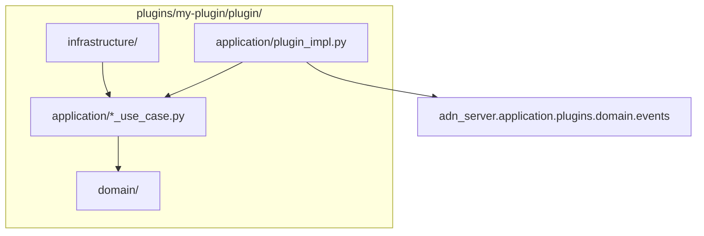

# Plugins

Los **plugins** drop-in amplían el peer server sin modificar el código del núcleo. El framework está en `src/adn_server/application/plugins/`; cada plugin es un directorio bajo `plugins/<name>/` cargado en tiempo de ejecución.

El repositorio incluye un skeleton de referencia: `plugins/example/` (deshabilitado por defecto).

---

## Estructura de directorios

```
plugins/<plugin-name>/
  config.yaml              # enabled: true|false (+ opciones)
  plugin/
    __init__.py            # debe exportar create_plugin()
    domain/                # lógica pura, sin I/O
    application/           # casos de uso, adaptador ServerPlugin
    infrastructure/        # archivos, HTTP, pools de hilos
  tests/
```

Activa un plugin en su `config.yaml` y recarga el servidor:

```bash
systemctl reload adn-server    # SIGHUP — reescanea plugins/
```

---

## Configuración del servidor (`PLUGINS`)

Bloque opcional en **`adn-server.yaml`** (no está en `adn-server.example.yaml`):

```yaml
PLUGINS:
  directory: plugins          # por defecto: <project_root>/plugins
  master_kill: false          # true → descarga todos los plugins
  overrides:
    my-plugin:
      some_key: value         # se fusiona con la config del plugin
```

| Clave | Función |
|-------|---------|
| `directory` | Ruta absoluta o relativa al project root |
| `master_kill` | Desactivación de emergencia — no carga plugins |
| `overrides` | Parches por plugin sin editar `plugins/<name>/config.yaml` |

Con **SIGHUP**, `PluginManager.rescan()` carga plugins nuevos, descarga los eliminados y llama `on_reload()` si cambió `config.yaml`.

### Claves reservadas en `config.yaml`

El loader las elimina antes de pasar la config a `on_load` / `on_reload`:

| Clave | Función |
|-------|---------|
| `enabled` | Debe ser `true` para cargar el plugin |
| `depends_on` | Lista de nombres — orden topológico de carga |
| `hot_reload_seconds` | Reservado para uso futuro |

---

## Contrato `ServerPlugin`

Definido en `src/adn_server/application/plugins/domain/protocol.py`:

| Método | Hilo | Función |
|--------|------|---------|
| `name: str` | — | Identificador (nombre del directorio) |
| `on_load(bus, config, server_ctx)` | reactor | Leer config; suscribirse al bus si hace falta |
| `on_event(event)` | **reactor** | Manejar eventos — **O(1), sin I/O bloqueante** |
| `on_reload(config)` | reactor | Hot-reload opcional tras cambio de `config.yaml` |
| `on_shutdown()` | reactor | Vaciar buffers; parar workers |

Punto de entrada:

```python
# plugins/<name>/plugin/__init__.py
def create_plugin() -> ServerPlugin:
    return MyPlugin()
```

---

## `ServerContext`

Se pasa a `on_load` como `server_ctx` (`application/plugins/application/context.py`):

| Campo | Uso |
|-------|-----|
| `config` | Dict de configuración completa del servidor |
| `project_root` | Ruta de instalación |
| `defer_to_thread(fn, *args)` | Ejecutar I/O bloqueante fuera del reactor |
| `call_from_reactor(fn, *args)` | Programar callback en el hilo del reactor |
| `call_later(delay_s, fn, *args)` | Temporizador del reactor |

**Patrón:** solo despachar en `on_event`; usar `defer_to_thread` para archivos, HTTP o CPU intensiva.

---

## Bus de eventos

`PluginBus` (`application/plugins/application/bus.py`) entrega eventos al `on_event` de cada plugin cargado.

- Los eventos se emiten **después del forward** de voz/datos (`emit_deferred` — siguiente tick del reactor).
- Excepciones no capturadas incrementan un contador; tras repetir fallos el plugin se **deshabilita** y se llama `on_shutdown()` (circuit breaker).
- `bus.subscribe(handler)` existe para handlers internos; los plugins suelen usar solo `on_event`.

---

## Tipos de evento

Dataclasses puras en `application/plugins/domain/events.py`. Importar en el plugin:

```python
from adn_server.application.plugins.domain.events import (
    VoiceCallStart,
    VoiceCallFrame,
    VoiceCallEnd,
    UnitDataStart,
    UnitDataFrame,
    UnitDataEnd,
)
```

| Evento | Cuándo |
|--------|--------|
| `VoiceCallStart` | Inicio de llamada de voz (grupo o privada) |
| `VoiceCallFrame` | Un frame AMBE (`dmrpkt`, `frame_type`, `dtype_vseq`) |
| `VoiceCallEnd` | Fin de llamada (`duration_s`, `frame_count`) |
| `UnitDataStart` | Inicio de sesión unit-data |
| `UnitDataFrame` | Un frame de datos (`raw_data`, `data_label`, `seq`, `bits`, …) |
| `UnitDataEnd` | Fin de sesión unit-data (`duration_s`, `packet_count`) |

Cada evento incluye **`CallLegContext`** (`event.context`):

| Campo | Significado |
|-------|-------------|
| `call_family` | `"GROUP"` o `"PRIVATE"` |
| `direction` | `"RX"` o `"TX"` |
| `origin_system` | Nombre del sistema lógico (pata del bridge) |
| `system_mode` | `MASTER`, `PEER` u `OPENBRIDGE` |
| `peer_id`, `src_id`, `dst_id`, `slot`, `stream_id` | Identificadores DMR |
| `server_id` | Id de servidor para informes |
| `is_synthetic`, `is_proxy_ingress` | Flags sintético / proxy |
| `pkt_time` | Timestamp Unix |
| `forwarded_systems` | Sistemas a los que se reenvió esta pata |
| `obp_*`, `ber`, `rssi` | Metadatos OpenBridge / RF si aplica |
| `extra` | Dict adicional (p. ej. talker alias al finalizar) |

Usa `event.context.to_metadata_dict()` para salida JSON.

Los eventos provienen de `VoicePluginBridge` y `DataPluginBridge`, enganchados al routing tras el forward.

---

## Clean architecture en plugins

Misma regla de dependencias hacia dentro que el núcleo ([Arquitectura](../development/architecture.md)):



| Capa | Responsabilidad |
|------|-----------------|
| `plugin/__init__.py` | Solo factory — `create_plugin()` |
| `application/plugin_impl.py` | Adaptador `ServerPlugin`: `isinstance`, delegar a use cases |
| `application/` | Orquestación (casos de uso, estado de sesión) |
| `domain/` | Tipos y reglas puras — sin Twisted, archivos ni sockets |
| `infrastructure/` | Writers, clientes HTTP, pools — usa `defer_to_thread` |

---

## Ejemplo de referencia

Estudia `plugins/example/` en la raíz del repositorio:

- `enabled: false` en el `config.yaml` versionado (sin secretos).
- Log `DEBUG` en cada evento.
- Escribe un JSON por sesión en `example-events/` al `VoiceCallEnd` / `UnitDataEnd`.
- Tests en `plugins/example/tests/`.

Para probarlo: `enabled: true`, reload, haz una llamada, revisa `example-events/<stream_id>.json`.

---

## Tests

Los tests del plugin van junto al plugin, no en `adn-server/tests/`:

```bash
cd plugins/example
python3 -m pytest tests/ -q
```

Los tests del framework (`test_plugin_bus.py`, `test_voice_bridge.py`, …) permanecen en el núcleo.

---

## Buenas prácticas

1. **No bloquear el reactor** en `on_event` — delegar I/O y trabajo pesado.
2. **Versionar `config.example.yaml`** junto al plugin; mantener `config.yaml` local y gitignored si lleva tokens.
3. **Capturar errores** en workers en segundo plano; excepciones en `on_event` activan el circuit breaker.
4. Usar **`depends_on`** cuando un plugin deba cargarse después de otro.
5. Copiar el skeleton **`example`** al crear un plugin nuevo — renombrar el directorio e implementar tu caso de uso.
